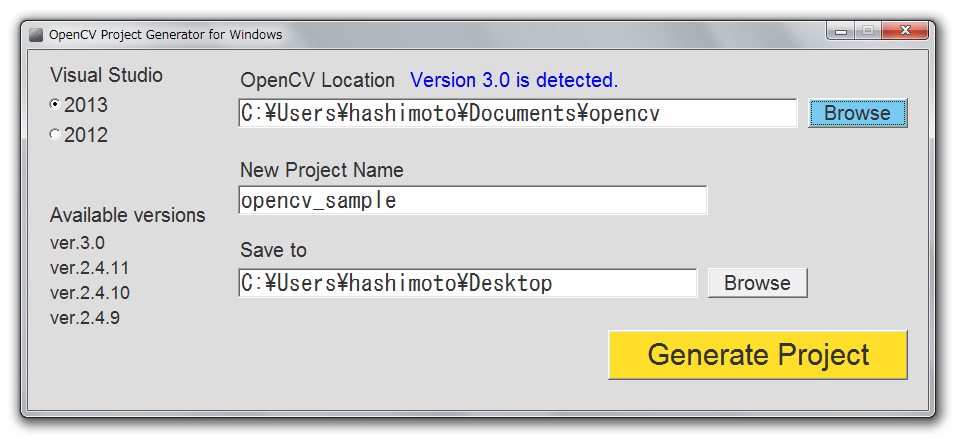

# OpenCV Project Generator
Project File Generator for OpenCV (Windows)

## How to use
1. Run OpenCVProjectGenerator.exe
2. Select OpenCV location.
3. Input new project name.
4. Select save location.
5. Push "Generate Project" button.

##Available versions
OpenCV 3.0 
OpenCV 2.4.11 
OpenCV 2.4.10 
OpenCV 2.4.9 
